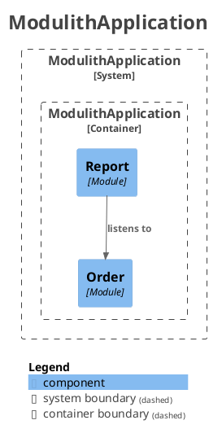

# Demo with Spring Modulith
* https://spring.io/projects/spring-modulith

## Structure of modules
* Store event in H2 database
```
REST API => order module === <OrderPlacedEvent>===> report module
```

## Show modules with PlantUML
Run test
```
$mvnw clean test
```

